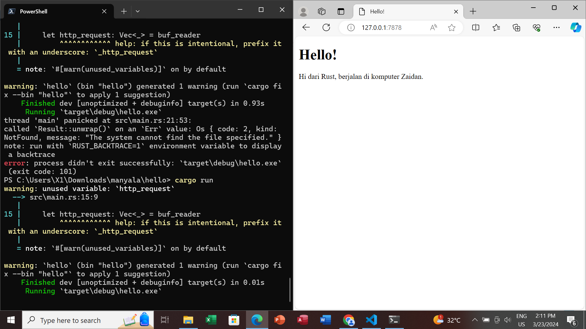
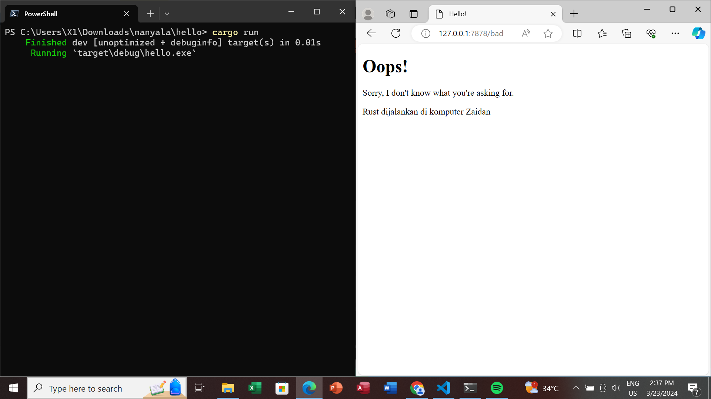

  
 Commit 1 Reflection Notes 

  Method `handle_connection` memiliki input stream berupa `TcpStream`. Method ini membaca HTTP Request dengan membuat `BufReader` untuk membaca buffer dari stream, lalu menggunakan `.lines()` untuk mereturn iterator baris dari `BufReader`. Selanjutnya, menggunakan `.map` untuk mengubah `Result` menjadi String dan menggunakan `.take_while()` untuk mengambil baris hingga akhir headers HTTP. Method ini juga akan mengumpulkan baris-baris tersebut ke dalam sebuah vektor `http_request`. Dari proses tersebut, akan ada output yang dicetak pada perintah `println!`.

  
 Commit 2 Reflection Notes 

  Text seperti Content-Length adalah HTTP response yang dikirimkan setelah kita menerima request HTTP, dalam hal ini adalah `hello.html`. Dari kode yang ada, dapat dilihat bahwa response yang ingin diberikan adalah `"{status_line}\r\nContent-Length: {length}\r\n\r\n{contents}"`. Di situ, `status_line` akan berisi status dari requestnya (misal berhasil atau tidak), lalu, `\r` menandakan carriage return, dan `\n` menandakan new line. Lalu, `Content-length` yang diisi dengan `{length}` adalah panjang dari body http responsenya (dalam konteks ini, `hello.html`), sedangkan `{contents}` berisi konten dari response itu sendiri. Hal ini diperlukan untuk memastikan bahwa HTTP responsenya valid

  

  
 Commit 3 Reflection Notes 

  Splitting response dilakukan dengan menggunakan conditional (bisa if-else, maupun switch case). Sebelum refaktorisasi, hal ini dilakukan dengan membuat if-else yang masing-masing akan membaca request lalu memilih, response mana yang diberikan. Apa bila `"GET / HTTP/1.1"`, akan diberikan response `hello.html`. Apabila `"HTTP/1.1 404 NOT FOUND"`, akan diberikan response `404.html`. 

  Setelah melihat kode tersebut, kita melihat adanya duplikasi terhadap proses pembacaan request dan pengiriman responsenya. Yang berbeda hanyalah file mana yang dirender. Agar memenuhi prinsip clean code dan menghindari duplikasi, kita hanya akan melakukan if else untuk memilih file yang akan dirender sebagai response. Selebihnya dijadikan satu kode saja. 

  

  *note: Pada commit ke tiga ini, saya juga melakukan refaktorisasi, tetapi lupa saya commit pada Commit 3. Bukti refaktorisasi tersebut dapat dilihat pada Commit 4.

  
 Commit 4 Reflection Notes 

  Pada kode tersebut, dapat dilihat bahwa terdapat tiga kemungkinan request yang akan ditangani oleh program. Salah satunya adalah `/sleep`. Pada saat `/sleep` direques, web akan melambat. hal ini dapat dilihat sebagai simulasi dari web ketika harus menangani request yang lambat. Hal tersebut dapat terjadi karena request `/sleep` akan membuat thread yang ada terhenti (sleep) selama 10 detik. Karena program tersebut belum dirancang untuk multi-thread, ketika `/sleep` dipanggil, thread akan berhenti selama 10 detik dan tidak dapat menangani request lainnya.

  
 Commit 5 Reflection Notes 

  Thread pool bekerja dengan cara menyediakan spawned threads yang menunggu perintah untuk dihandle. Ketika ada task baru yang muncul, thread yang masih tersedia akan menangani task Tersebut. Kita tidak perlu membuat sebuah thread baru untuk setiap task. Alih-alih melakukan hal tersebut, lebih baik memiliki jumlah thread yang finite, dan menampung task baru yang muncul dalam sebuah queue serta mem-popnya saat ada thread yang kosong. Jika kita memilih untuk membuat thread yang tidak terbatas, dikhawatirkan akan ada pengguna yang menggunakan semua resource di server kita saat membuat request terlalu banyak. 

